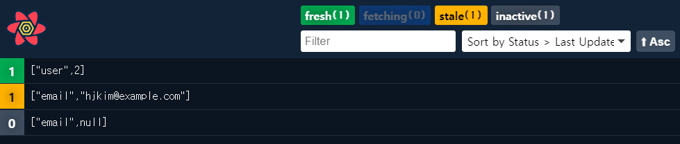
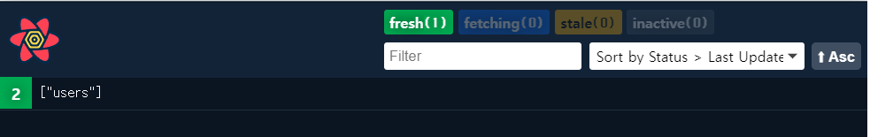
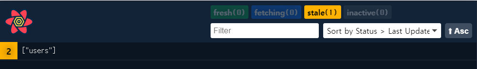
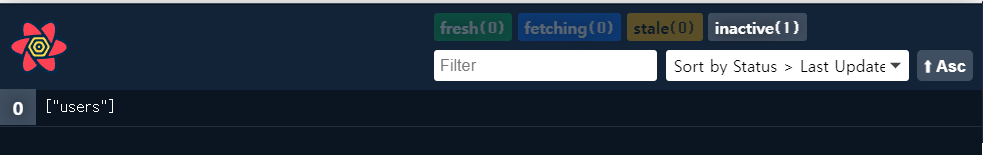
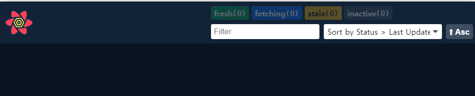
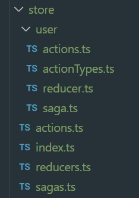

<br />

#
- [React Query란?](#react-query란)
  - [배경](#배경)
  - [장점](#장점)
  - [단점](#단점)
  - [Query 데이터의 Lifecycle](#query-데이터의-lifecycle)
  - [Important default](#important-default)
  - [staleTime vs cacheTime](#staletime-vs-cachetime)
  - [fetching 비교](#fetching-비교)
  - [VS Redux](#vs-redux)
    - [Redux 사용 시 추가되는 코드](#redux-사용-시-추가되는-코드)
- [실행](#실행)
- [처음부터 하기](#처음부터-하기)
  - [cra 를 이용한 생성](#cra-를-이용한-생성)
  - [Add React Query](#add-react-query)
  - [Using Json Server](#using-json-server)
  - [Other Dependency](#other-dependency)
- [Vue Query?](#vue-query)

#

## [React Query란?](https://react-query.tanstack.com/)
- React 에서 데이터 가져오기(fetching), 캐싱(caching), 동기화 및 업데이트를 제공하는 라이브러리
- Fetch, cache and update data in your React and React Native applications all without touching any "global state"
  - 전역 상태를 건드리지 않고 React와 React Native 어플리케이션에서 데이터를 가져오고, 캐시하고, 업데이트
<br /><br />

### 배경
 - 전역 상태 관리를 위해 Redux(또는 mobx)를 사용해 왔다.
 - Redux의 비동기 통신을 위해 Redux Saga를 사용해 왔다.
 - Redux의 방대한 상용구 코드(boilerplate code)로 인하여 store가 너무 커졌다.
 - 비동기 통신의 응답 이외에 전역 상태를 관리하고 있는가? -> ui에 관련된 상태를 제외하곤, 대부분 비동기 통신의 응답만을 상태 관리해왔다.
 - 비동기 통신을 분리할 방법이 있는가? -> React Query!!!!
<br /><br />

### 장점
 - 전역 상태를 관리하기 위한 복잡한 코드들이 생략되어 빠르게 개발 할 수 있다.
 - 간단하고 친숙한 사용법
 - Devtools 지원
 - Next.js 지원
<br /><br />

### 단점
 - 사용해 보면서 찾아야 함.
<br /><br />

### Query 데이터의 Lifecycle
 - fetching : 데이터 요청
 - fresh : 데이터가 만료되지 않은 상태
 - stale : 데이터가 만료된 상태
 - inactvie : 사용하지 않는 상태
   - 일정 시간(default 5min)이 지나면 GC가 캐시에서 제거
 - delete : GC에 의해 캐시에서 제거된 상태 
<br />

<p align="center">
    
</p>
<br />

### Important default
 - useQuery로 가져온 데이터는 stale 상태가 된다.
   - staleTime 으로 stale 상태로 바뀌는 시간을 변경
 - 다음의 경우 stale 쿼리를 백그라운드에서 자동으로 다시 가져온다.
   - 새로운 쿼리 인스턴스가 마운트 되었을 때
   - 브라우저 윈도우가 다시 포커스 되었을 때
   - 네트워크가 다시 연결되었을 때
   - refetchInterval 옵션이 있을 때
 - 활성화된 useQuery 인스턴스가 없는 경우 inactive 됨.
 - 실패한 쿼리는 자동으로 3번 재시도 되며 이후, 에러 처리
   - retry, retryDelay 옵션
 - 쿼리 결과는 structurally shared 를 사용하여 데이터가 실제로 변경되었는지 체크
<br /><br />

### staleTime vs cacheTime
 - staleTime
   - 데이터가 fresh -> stale 상태로 변경되는데 걸리는 시간
   - fresh 상태일 경우 쿼리 인스턴스가 mount 되어도 fetch가 발생하지 않음
   - 데이터가 한번 fetch 된 후, stale time이 지나지 않았다면, unmount -> mount 되어도 fetch가 발생하지 않음.
<br />

 - cacheTime
   - 데이터가 inactive 상태일 때 캐싱된 상태로 남아있는 시간
   - 쿼리 인스턴스가 ummount되면 데이터는 inactive 상태로 변경
   - cacheTime이 지나면 CG로 수집
   - cacheTime이 지나기 전에 다시 mount 되면, 데이터를 fetch 하는 동안 캐시 데이터를 보여줌
<br /><br />

``` Javascript
return useQuery<UserProps[], Error>(
        `users`,
        () => fetchUsers(),
        {
            ...
            staleTime: 2000,
            cacheTime: 4000,
            ...
        }
    )
```
<p align="center">
    query client 옵션
</p>
<br />

<p align="center">
    
    fresh
</p>
<p align="center">
    
    2000ms 뒤 stale로 변경
</p>
<p align="center">
    
    umount inactive로 변경
</p>
<p align="center">
    
    4000ms 뒤 gc에 수집 됨
</p>
<br /><br />

### fetching 비교
이전 방식과 react query 를 사용한 방식 전체 코드 및 다른 부분 비교 snippet
``` Javascript
import { useEffect, useState } from 'react'
import axios from 'axios'
import { UserProps } from '../types'

/**
 * 이전 방식
 */
const FetchPage = () => {

    const [isLoading, setIsLoading] = useState(true)
    const [data, setData] = useState<UserProps[]>([])

    useEffect(() => {
        axios.get(`http://localhost:4000/users`).then(res => {
            setData(res.data)
            setIsLoading(false)
        })
    }, [])

    if (isLoading) return <div>Loading</div>

    return (
        <div>
            {
                data?.map( user => {
                    return <div key={user.id}>{user.name}:{user.email}</div>
                })
            }
        </div>
    )
}

export default FetchPage
```

``` Javascript
import axios from "axios"
import { useQuery } from "react-query"
import { UserProps } from "../types"

/**
 * React Query 사용
 */
const FetchByQueryPage = () => {

    const { isLoading, data } = useQuery('users', () => {
        return axios.get<UserProps[] >(`http://localhost:4000/users`)
    })

    if (isLoading) return <div>Loading</div>

    return (
        <div>
            {
                data?.data.map( user => {
                    return <div key={user.id}>{user.name}:{user.email}</div>
                })
            }
        </div>
    )
}

export default FetchByQueryPage
```

useEffect와 useState 구문을 걷어내어 깔끔해 보인다.
``` Javascript
    const [isLoading, setIsLoading] = useState(true)
    const [data, setData] = useState<UserProps[]>([])

    useEffect(() => {
        axios.get(`http://localhost:4000/users`).then(res => {
            setData(res.data)
            setIsLoading(false)
        })
    }, [])

------------------------------------- VS -----------------------------------------

    const { isLoading, data } = useQuery('users', () => {
        return axios.get<UserProps[] >(`http://localhost:4000/users`)
    })

```
<br /><br />

### VS Redux
Redux + Redux Saga

 - **추가되는 상용구 코드를 모두 걷어낼 수 있다!!!!**

 - **React Query가 Redux와 같은 동작을 보장하진 않는다.**
   - React Query를 이용하여 Redux 와 비슷한 결과(전역 상태 얻기)를 낼 수 있다!!


``` Javascript
import { useEffect } from "react"
import { getUsers } from "../store/actions"
import { useSelector, useDispatch } from "react-redux"
import { UserProps } from "../types"

const ReduxPage = () => {

    const dispatch = useDispatch()

    const User = useSelector((state: any) => state.User)
    
    useEffect(() => {
        dispatch(getUsers())
    }, [])

    return (
        <div>
        {
            User.users && (
                User.users?.map((user : UserProps) => {
                    return <div key={user.id}>{user.name}:{user.email}</div>
                })
            )
        }
        </div>
    )
}

export default ReduxPage
```
<br />

<p align="center">
    
</p>
<p align="center">store 구조</p>

<br />

#### Redux 사용 시 추가되는 코드
``` Javascript
actionTypes.ts

export const GET_USERS = `GET_USERS`
export const GET_USERS_SUCCESS = `GET_USERS_SUCCESS`

------------------------------------------------------

actions.ts

import { GET_USERS, GET_USERS_SUCCESS } from './actionTypes'

export const getUsers = () => {
    return {
        type: GET_USERS
    }
}

export const getUsersSuccess = (users: object) => {
    return {
        type: GET_USERS_SUCCESS,
        payload: users
    }
}

---------------------------------------------------

reducer.ts

import { UserProps } from "../../types"
import { GET_USERS_SUCCESS } from "./actionTypes"

const initialState: { users: UserProps[] } = {
    users: []
}

const user = (state = initialState, action: any) => {

    switch (action.type) {

        case GET_USERS_SUCCESS : {
        
            state = {
                ...state,
                users : action.payload
            }

            console.log(`users ${state.users}`)

            break
        }

        default :
            state = { ...state }
            break
    }

    return state
}

export default user

---------------------------------------------------

saga.ts

import { GET_USERS } from "./actionTypes"
import { getUsersSuccess } from "./actions"
import { apiGet } from "../../api/api"
import { all, call, put, takeEvery, fork } from 'redux-saga/effects'

function* getUsers(urlParam: any): any {
    const response = yield call(apiGet, `users`, urlParam.payload)

    yield put(getUsersSuccess(response))
}

export function* watchGetUsers() {
    yield takeEvery(GET_USERS, getUsers)
}

function* UserSaga() {
    yield all([
        fork(watchGetUsers)
    ])
}

export default UserSaga

```

<br /><br />

## 실행
  1. npm install
  2. yarn add json-server
  3. yarn start
<br /><br />


## 처음부터 하기
<br />

### cra 를 이용한 생성
**npx create-react-app appname --template typescipt**
<br />

### Add React Query
- yarn add react-query @types/react-query
<br />

### Using Json Server
- yarn add json-server
<br />

dummy.json
``` Javascript
{
    "users": [
        {
            "id": 1,
            "name": "herace",
            "email": "herace@example.com"
        },
        {
            "id": 2,
            "name": "hjkim",
            "email": "hjkim@example.com"
        }
    ]
}
```

add script
``` Javascript
"scripts": {
    ...
    "serve-json": "json-server --watch data/dummy.json --port 4000"
}
```

- yarn serve-json


### Other Dependency
 - yarn add axios react-router-dom @types/react-router-dom
<br /><br />

## Vue Query?
[Vue Query](https://vue-query.vercel.app/#/)
